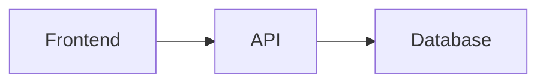

# Product Requirements Document (PRD)

> This document defines the product requirements. It should be filled out by the requirements analyst and/or the developer before starting development. The AI agent uses this document as context to understand WHAT to build.

## 1. Executive Summary

<!-- Describe in 2-3 sentences what the product is and what problem it solves -->

## 2. Target Users

<!-- Who will use the system? Describe the personas -->

### Persona 1: [Name]
- **Profile:**
- **Goals:**
- **Pain points:**

## 3. MVP Scope

### Included in MVP
- [ ] Feature 1
- [ ] Feature 2
- [ ] Feature 3

### Out of MVP (future)
- [ ] Future feature 1
- [ ] Future feature 2

## 4. User Stories

### US01: [Title]
**As** [persona], **I want** [action], **so that** [benefit].

**Acceptance criteria:**
- [ ] AC1:
- [ ] AC2:

### US02: [Title]
**As** [persona], **I want** [action], **so that** [benefit].

**Acceptance criteria:**
- [ ] AC1:
- [ ] AC2:

## 5. High-Level Architecture

<!-- Mermaid or ASCII diagram showing the main components -->



### Directory Structure

```
project/
├── src/
├── tests/
└── ...
```

## 6. Detailed Features

### Feature 1: [Name]
- **Description:**
- **Business rules:**
  -
- **Inputs:**
- **Outputs:**
- **Edge cases:**
  -

### Feature 2: [Name]
- **Description:**
- **Business rules:**
  -

## 7. Technology Stack

| Component | Technology | Justification |
|---|---|---|
| Backend | | |
| Frontend | | |
| Database | | |
| Cache | | |
| Deploy | | |

## 8. API Specification

### Endpoints

#### `GET /api/v1/resource`
- **Description:**
- **Response:** `200 OK`
```json
{
  "items": [],
  "total": 0,
  "page": 1,
  "size": 20
}
```

#### `POST /api/v1/resource`
- **Description:**
- **Body:**
```json
{
  "field": "value"
}
```
- **Response:** `201 Created`

## 9. Data Model

```sql
CREATE TABLE example (
    id UUID PRIMARY KEY DEFAULT gen_random_uuid(),
    name VARCHAR(100) NOT NULL,
    created_at TIMESTAMP DEFAULT NOW()
);
```

## 10. Non-Functional Requirements

| Requirement | Target | Priority |
|---|---|---|
| Performance | Response time < 500ms | High |
| Availability | 99.9% uptime | Medium |
| Security | OWASP Top 10 | High |
| Scalability | Up to X simultaneous users | Medium |

## 11. Implementation Phases

### Phase 1: Foundation
- [ ] Project setup
- [ ] Data model
- [ ] Basic endpoints

### Phase 2: Core Features
- [ ] Feature 1 complete
- [ ] Feature 2 complete

### Phase 3: Polish
- [ ] E2E tests
- [ ] Performance
- [ ] Documentation

## 12. Risks and Mitigations

| Risk | Impact | Probability | Mitigation |
|---|---|---|---|
| | | | |

## 13. Success Criteria

- [ ] Criterion 1
- [ ] Criterion 2
- [ ] Criterion 3
